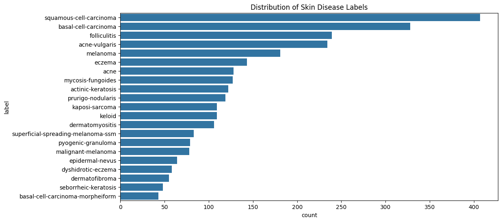
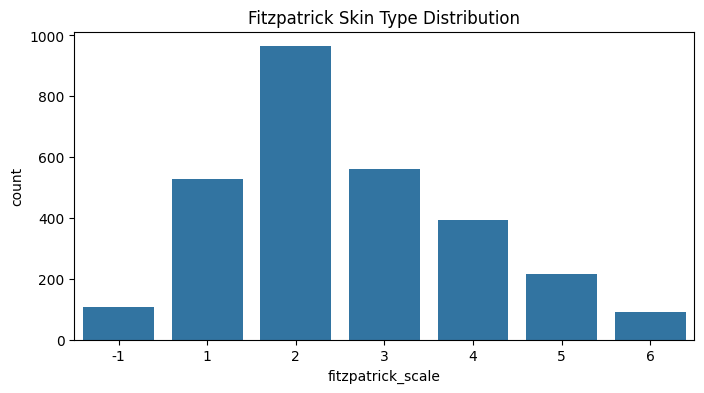

# GitHub AJL Kaggle Project README

### **👥 Team Members**

| Name       | GitHub Handle |
| ---------- | ------------- |
| Vanessa Orozco | @orozcov    |
| Oscar Khaing | @OscarKhaing    |
| Shaina Wang | @swang029    |
| Safia Boutaleb | @safiabout  |
| Donald Ton | @Teammate5    |
| Zophia Laud | @Teammate6    |

---

## **🎯 Project Highlights**

- Built a deep learning model using convolutional neural networks (CNNs) with transfer learning to classify 21 different skin conditions across diverse skin tones.
- Used the **Xception** model for feature extraction and classification.
- Achieved an F1-score of **0.17743** on the validation dataset.
- Implemented **data augmentation** techniques to mitigate dataset imbalances and improve fairness.
🔗 [Equitable AI for Dermatology | Kaggle Competition Page](https://www.kaggle.com/competitions/bttai-ajl-2025/overview)

---

## **👩🏽‍💻 Setup & Execution**

### **Prerequisites**

1. Clone the repository:
   ```bash
   git clone https://github.com/your-repo/skin-condition-classifier.git
   cd skin-condition-classifier
   ```
2. Create and activate a virtual environment:
   ```bash
   python -m venv venv
   source venv/bin/activate  # On Windows use: venv\Scripts\activate
   ```
3. Install dependencies:
   ```bash
   pip install -r requirements.txt
   ```
4. Ensure Jupyter Notebook is installed and add the virtual environment to Jupyter:
   ```bash
   pip install jupyter
   python -m ipykernel install --user --name=venv --display-name "Python (venv)"
   ```
5. Download the dataset from Kaggle and place it in the project directory.
6. Run the Jupyter Notebook to train the model

---

## **🏗️ Project Overview**

Our project is part of the **Break Through Tech AI Program**, focusing on the **Algorithmic Justice League (AJL) Challenge**. The objective is to develop an AI model that can accurately classify dermatological conditions across diverse skin tones. This is crucial because existing models often underperform on darker skin tones due to dataset biases. Our work aims to bridge this gap and improve dermatological AI for equitable healthcare outcomes.

---

## **📊 Data Exploration**

### **Dataset Description**
The dataset consists of images labeled with one of 21 skin conditions and includes metadata such as the Fitzpatrick skin type classification. The key attributes in the dataset are:
- `label`: The skin disease category.
- `fitzpatrick_scale`: A numerical classification of skin tone from 1 (lightest) to 6 (darkest).
- `ddi_scale`: A dermatological diversity index score.

### **Data Summary**
Below is an overview of the dataset:

| Feature | Count | Mean | Std Dev | Min | 25% | 50% | 75% | Max |
|---------|-------|------|---------|-----|-----|-----|-----|-----|
| Fitzpatrick Scale | 2860 | 2.52 | 1.47 | -1 | 2 | 2 | 3 | 6 |
| DDI Scale | 2860 | 23.55 | 15.53 | -1 | 12 | 12 | 34 | 56 |

**Class Distribution:**
- The dataset is imbalanced, with some conditions (e.g., squamous-cell carcinoma) appearing significantly more frequently than others (e.g., basal-cell carcinoma-morpheiform).
- The Fitzpatrick scale distribution is skewed towards lighter skin tones (Types 1-3), with fewer examples of darker skin tones (Types 4-6).

### **Key Visualizations**
- **Skin Disease Distribution:** A horizontal bar plot shows the count of images per disease category, highlighting class imbalance.

- **Fitzpatrick Skin Type Distribution:** A histogram displays the number of images across different Fitzpatrick skin tones, illustrating underrepresentation of darker tones.


These insights help inform data augmentation and rebalancing strategies to improve model fairness.

---

## **🧠 Model Development**

Our approach leveraged the **Xception** model, fine-tuned on our dataset. Key components:

- **Preprocessing:** Resized images to **224x224**, applied normalization.
- **Augmentation:** Random flips, rotations, and brightness adjustments to improve generalization.
- **Loss Function:** Cross-entropy loss with class weighting.
- **Optimization:** Adam optimizer with a learning rate of **1e-4**.
- **Evaluation Metrics:** F1-score.

---

## **📈 Results & Key Findings**

- **F1-Score:** 0.17743

---

## **🖼️ Impact Narrative**

Our model aims to improve dermatological AI fairness by:

1. Addressing dataset biases through augmentation and balanced training.
2. Evaluating fairness metrics beyond traditional accuracy.
3. Encouraging healthcare AI developers to consider inclusivity in medical AI.

Broader impacts include:

- **Advancing equitable AI in healthcare.**
- **Raising awareness of bias in medical AI models.**
- **Providing insights for future dermatology AI improvements.**

---

## **🚀 Next Steps & Future Improvements**

- **Increase dataset diversity** by incorporating external skin condition datasets.
- **Optimize model architecture** using efficient lightweight CNNs for deployment on mobile devices.
- **Implement active learning** to refine predictions with clinician feedback.
- **Develop a fairness-aware loss function** to penalize biases in model learning.

---